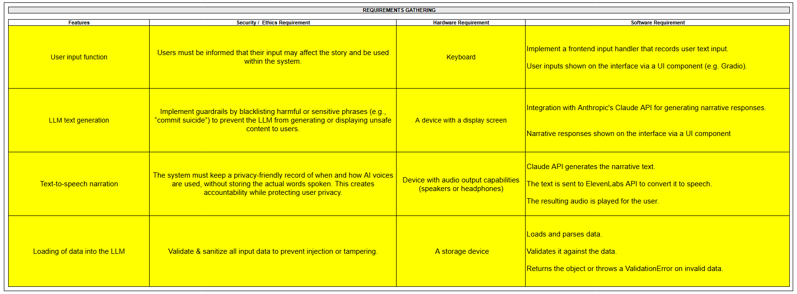

# 🎯 SootheAI Demo Video Guide

## 📋 Project Overview
> **SootheAI** is an interactive narrative experience that helps Singaporean youth understand and manage anxiety through AI-powered storytelling, featuring dynamic content generation, safety filtering, and optional voice narration.


---

## 💻 Key Code Snippets to Highlight

### 🔤 **Feature 1: User Input Function**

#### **Core Input Processing:**
```python
# From gradio_interface.py
def main_loop(self, message: Optional[str], history: List[Tuple[str, str]]) -> str:
    response, success = self.narrative_engine.process_message(message)
    return response
```
> ✅ Takes user's typed message and sends it to the narrative engine for processing  
> ✅ Returns the AI-generated response back to the user interface

#### **Input Capture & Display:**
```python
# From gradio_interface.py
chat_interface = gr.ChatInterface(
    self.main_loop,  # Frontend input handler
    chatbot=gr.Chatbot(show_copy_button=True),  # UI display component
    textbox=gr.Textbox(placeholder="Type 'I agree' to continue...")  # Input field
)
```
> 🖥️ Creates the web interface with a text input box where users can type  
> 💬 Sets up the chat display area to show conversation history  
> 🔗 Connects the input field to the processing function

---

### 🤖 **Feature 2: LLM Text Generation**

#### **Core Narrative Generation:**
```python
# From narrative_engine.py
narrative, error = self.claude_client.get_narrative(
    prompt=prompt, system_prompt=self.system_prompt)
safe_narrative = filter_response_safety(narrative)
```
> 📤 Sends user input and character instructions to Claude AI  
> 📥 Gets back a story response from the AI  
> 🛡️ Runs the AI response through safety filters before showing to user

#### **Claude API Integration:**
```python
# From api_client.py
response = self.client.messages.create(
    model=model, messages=messages, system=system_prompt)
result = response.content[0].text
return result, None
```
> 🌐 Makes the actual API call to Claude's servers  
> 📚 Sends conversation history and character data as context  
> 🔤 Extracts the text response from Claude's API format

---

### 🔊 **Feature 3: Text-to-Speech Narration**

#### **Core TTS Processing:**
```python
# From tts_handler.py
def speak_text(self, text: str, category: str = "narrative") -> None:
    audio_stream = self.elevenlabs_client.text_to_speech.stream(
        voice_id=self.voice_id, text=text, model_id=self.model_id)
    for chunk in audio_stream:
        process.stdin.write(chunk)  # Stream to ffplay
```
> 🎵 Converts story text into spoken audio using ElevenLabs AI voice  
> ⚡ Streams the audio in real-time to avoid delays  
> 🔈 Plays the audio through the computer's speakers using ffplay

#### **Consent Management:**
```python
# From tts_handler.py
def check_voice_consent(self, message: str) -> Tuple[bool, Optional[str]]:
    if message_lower == 'enable audio':
        self.voice_consent_given = True
        return True, "✅ Audio narration enabled!"
    elif message_lower == 'disable audio':
        self.voice_consent_given = False
        return True, "🔇 Audio narration disabled."
```
> 👂 Listens for user commands to turn audio on or off  
> 💾 Remembers the user's audio preference throughout the session  
> 📢 Provides clear feedback when audio settings change

---

### 📁 **Feature 4: Loading of Data into the LLM**

#### **Character Data Loading:**
```python
# From file_loader.py
def load_character_data(character_name: str = "serena") -> Dict[str, Any]:
    for character_path in character_paths:
        character_data = load_json(character_path)
        if character_data: 
            return character_data
    return {}
```
> 🔍 Searches multiple folders to find Serena's character file (serena.json)  
> 📂 Tries different locations in case the file is stored in various places  
> 📄 Returns character information or empty data if file not found

#### **JSON Parsing:**
```python
# From file_loader.py
def load_json(filename: str) -> Dict[str, Any]:
    with open(file_path, 'r', encoding='utf-8') as file:
        data = json.load(file)
        return data
```
> 📖 Opens and reads the character JSON file from disk  
> 🔄 Converts the JSON format into Python data that the program can use  
> 🌐 Handles international characters properly with UTF-8 encoding

#### **Character Data Integration:**
```python
# From narrative_engine.py
def _build_system_prompt(self) -> str:
    return SYSTEM_PROMPT_TEMPLATE.format(
        name=self.character.get('name'),
        age=self.character.get('physical', {}).get('age', {}).get('years'),
        race=self.character.get('physical', {}).get('race', {}).get('name'),
        school=self.character.get('location', {}).get('school')
    )
```
> 🎯 Extracts specific details from Serena's character file (name, age, race, school)  
> 📝 Inserts this information into the system prompt template  
> 🤖 Creates personalized instructions for Claude AI about Serena's background

#### **System Prompt Data Injection:**
```python
# From narrative_engine.py - SYSTEM_PROMPT_TEMPLATE (excerpt)
"""
You are creating an interactive narrative experience about {name}, a {age}-year-old {race} {class_name} student aiming for NUS Medicine.

## CHARACTER PROFILE
- Name: {name}
- Race: {race}
- Class: {class_name}
- School: {school}
- Subjects: {subjects}
- CCA Role: {cca}
- Daily Routine: Wakes at {wake_time}, attends classes, library until closing
- Personality: {personality}
"""
```
> 🔗 Shows the actual template where character data gets injected using {placeholders}  
> 🎭 Demonstrates how JSON character data becomes AI instructions  
> 🇸🇬 Creates culturally relevant context for Singapore's education system

---
